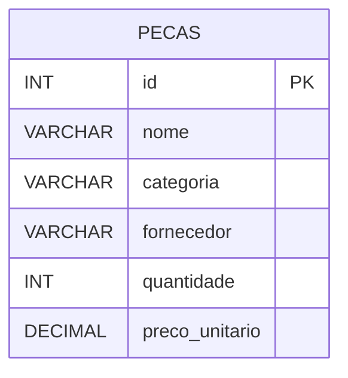

# API Almoxarifado - Controle de Peças de Reposição

## 📌 Descrição

Este projeto consiste no desenvolvimento de uma API REST em PHP utilizando PDO para realizar o gerenciamento de peças de reposição de um almoxarifado.

A API permite cadastrar, consultar, atualizar e excluir peças armazenadas no estoque, retornando todas as respostas no formato JSON.

O projeto foi desenvolvido como atividade prática da disciplina de APIs e Consultas SQL.

## 🛠 Tecnologias utilizadas
- PHP
- PDO
- PostgreSQL
- JSON

## 📂 Banco de Dados

### Criação de banco de dados "almoxarifado":
Nesta etapa foi criado o banco de dados almoxarifado, que será responsável por armazenar todas as informações referentes às peças de reposição cadastradas pela API. Esse banco servirá como base para todas as operações de cadastro, consulta, atualização e exclusão de dados.


### Banco de Dados criados:
Após a criação, é possível visualizar o banco almoxarifado na lista de bancos de dados disponíveis no PostgreSQL. Isso confirma que a criação foi realizada com sucesso e que o ambiente está pronto para receber as tabelas e os registros da aplicação.


### Conexão com Banco de Dados:
Nesta etapa foi implementada a conexão da API com o banco de dados utilizando PHP e a biblioteca PDO. A conexão permite que a aplicação execute comandos SQL de forma segura, facilitando as operações de CRUD e o tratamento de possíveis erros durante o acesso ao banco de dados.


Banco de Dados: **almoxarifado**

Tabela: **pecas**

## Campos


## 📋 Regras de Negócio
A API possui as seguintes validações:
Todos os campos obrigatórios devem ser informados.
A categoria aceita apenas:

- eletrica
- mecanica
- hidraulica

Outros Aspectos: 

- A quantidade não pode ser negativa.
- O preço unitário deve ser maior que zero.
- Todas as respostas da API são retornadas em formato JSON.

## Endpoints da API
### POST
Cadastra uma nova peça.
```json
[
  {
    "id": 1,
    "nome": "Alternador 12V 100A (Reforçado)",
    "categoria": "eletrica",
    "fornecedor": "Bosch",
    "quantidade": 10,
    "preco_unitario": 490.00
  },
  {
    "id": 2,
    "nome": "Motor de Partida 12V High Performance",
    "categoria": "eletrica",
    "fornecedor": "Valeo",
    "quantidade": 12,
    "preco_unitario": 410.00
  },
  {
    "id": 3,
    "nome": "Relê Auxiliar 40A DNI",
    "categoria": "eletrica",
    "fornecedor": "DNI",
    "quantidade": 60,
    "preco_unitario": 17.50
  },
  {
    "id": 4,
    "nome": "Jogo de Cabos de Ignição de Silicone",
    "categoria": "eletrica",
    "fornecedor": "NGK",
    "quantidade": 20,
    "preco_unitario": 135.00
  },
  {
    "id": 5,
    "nome": "Sensor de Posição da Borboleta (TPS)",
    "categoria": "eletrica",
    "fornecedor": "Magneti Marelli",
    "quantidade": 15,
    "preco_unitario": 92.00
  },
  {
    "id": 6,
    "nome": "Par de Discos de Freio Ventilados 280mm",
    "categoria": "mecanica",
    "fornecedor": "Fremax",
    "quantidade": 18,
    "preco_unitario": 230.00
  },
  {
    "id": 7,
    "nome": "Amortecedor Dianteiro Turbo Gás",
    "categoria": "mecanica",
    "fornecedor": "Monroe",
    "quantidade": 8,
    "preco_unitario": 345.00
  },
  {
    "id": 8,
    "nome": "Kit Correia Dentada + Tensor HD",
    "categoria": "mecanica",
    "fornecedor": "Dayco",
    "quantidade": 22,
    "preco_unitario": 205.00
  },
  {
    "id": 9,
    "nome": "Bomba de Água com Junta",
    "categoria": "mecanica",
    "fornecedor": "Urba",
    "quantidade": 14,
    "preco_unitario": 155.00
  },
  {
    "id": 10,
    "nome": "Junta do Cabeçote em Aço Multi-folha",
    "categoria": "mecanica",
    "fornecedor": "Sabó",
    "quantidade": 25,
    "preco_unitario": 82.00
  },
  {
    "id": 11,
    "nome": "Bomba de Direção Hidráulica Progressiva",
    "categoria": "hidraulica",
    "fornecedor": "DHB",
    "quantidade": 5,
    "preco_unitario": 550.00
  },
  {
    "id": 12,
    "nome": "Cilindro Mestre Duplo com Reservatório",
    "categoria": "hidraulica",
    "fornecedor": "TRW",
    "quantidade": 11,
    "preco_unitario": 245.00
  },
  {
    "id": 13,
    "nome": "Mangueira de Alta Pressão Relevada",
    "categoria": "hidraulica",
    "fornecedor": "Gates",
    "quantidade": 30,
    "preco_unitario": 105.00
  },
  {
    "id": 14,
    "nome": "Válvula Direcional Hidráulica Proporcional",
    "categoria": "hidraulica",
    "fornecedor": "Rexroth",
    "quantidade": 4,
    "preco_unitario": 920.00
  },
  {
    "id": 15,
    "nome": "Cilindro Atuador de Embreagem Hidráulico",
    "categoria": "hidraulica",
    "fornecedor": "LUK",
    "quantidade": 18,
    "preco_unitario": 175.00
  }
]
```
**Resposta:**

```json
{
    "mensagem":"Produto cadastrado com sucesso."
}
```
## GET
Lista todas as peças cadastradas.

**Resposta:**


## 📦 Registros Inseridos
Foram cadastradas entre 10 e 15 peças utilizando exclusivamente o método POST da API.

Os registros contemplam:

- Categoria elétrica
- Categoria mecânica
- Categoria hidráulica

Além disso, foram utilizados diferentes:

- fornecedores
- quantidades
- preços unitários

## 📊 Consultas SQL

1. Total de unidades de peças
```sql
SELECT SUM(quantidade) AS total_pecas
FROM pecas;
```
Retorna a soma de todas as unidades armazenadas no almoxarifado.


2. Valor total do estoque
```sql
SELECT SUM(preco_unitario * quantidade) AS total_valor_pecas
FROM pecas;
```
Calcula o valor financeiro total do estoque considerando quantidade × preço unitário.


3. Peça mais cara
```sql
SELECT MAX(preco_unitario) AS peca_mais_cara
FROM pecas;
```
Retorna o maior preço unitário cadastrado.


4. Peça mais barata
```sql
SELECT MIN(preco_unitario) AS peca_mais_barata
FROM pecas;
```
Retorna o menor preço unitário cadastrado.


5. Média dos preços
```sql
SELECT ROUND(AVG(preco_unitario), 2) AS media_preco_pecas
FROM pecas;
```
Calcula a média dos preços unitários com duas casas decimais.


6. Valor do estoque da categoria elétrica
```sql
SELECT SUM(preco_unitario * quantidade) AS valor_estoque_eletrica
FROM pecas
WHERE categoria = 'eletrica';
```
Calcula o valor total das peças pertencentes à categoria elétrica.


## ✅ Funcionalidades
- Cadastro de peças
- Listagem de peças
- Atualização de peças
- Exclusão de peças
- Validação dos dados
- Retorno em JSON
- Conexão segura utilizando PDO
- Consultas SQL utilizando:

## Funções Utilizadas:
- SUM
- MAX
- MIN
- AVG

